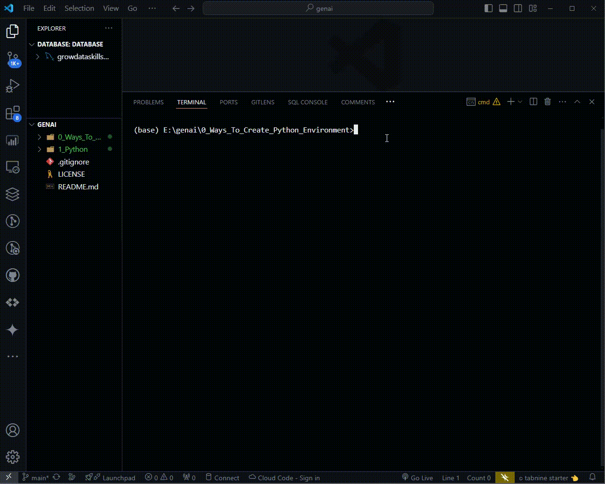
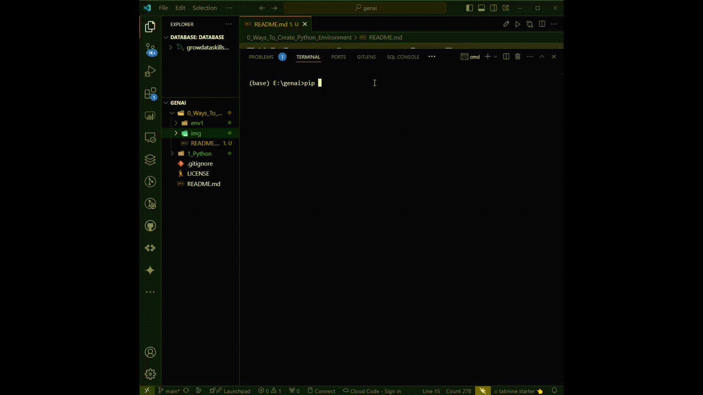

# Ways To Creating A Python Virtual Environment

1. **Using Python Command:**

```python
python -m venv <name_of_environment>

# I used the below command in command prompt
python -m venv env1

# To deactivate, just type
deactivate
```



2. **Using virtualenv package:**

```python
# Install virtualenv library
pip install virtualenv

# To create environment this is the command template
virtualenv -p python3 <name_of_environment>

# I used this environment name below:
virtualenv -p python3 env2

# To deactivate, just type
deactivate

```



Let's try to activate the created envirment

```
# To activate environment
<environment_name>\Scripts\activate

# Example
env2\Scripts\activate

# To check python version
python --version
```


3. **Through Conda Command (Install Anaconda or mini conda before it)**

```python
# Install Anaconda or mini conda software

# Type conda to check otherwise set it in system environment variable - edit system environment variables
# To create virtual environment using conda
conda create -p <environment_name> python==<python_version_you_want_to_use> -y

# let's take an example
conda create -p env3 python==3.10 -y

# To active it <environment_name> is env3
<environment_name>\Scripts\activate

```


Now, above better option is no. 3 according to my personal experience but we can create virtual environment without using Anaconda or mini conda software too.
