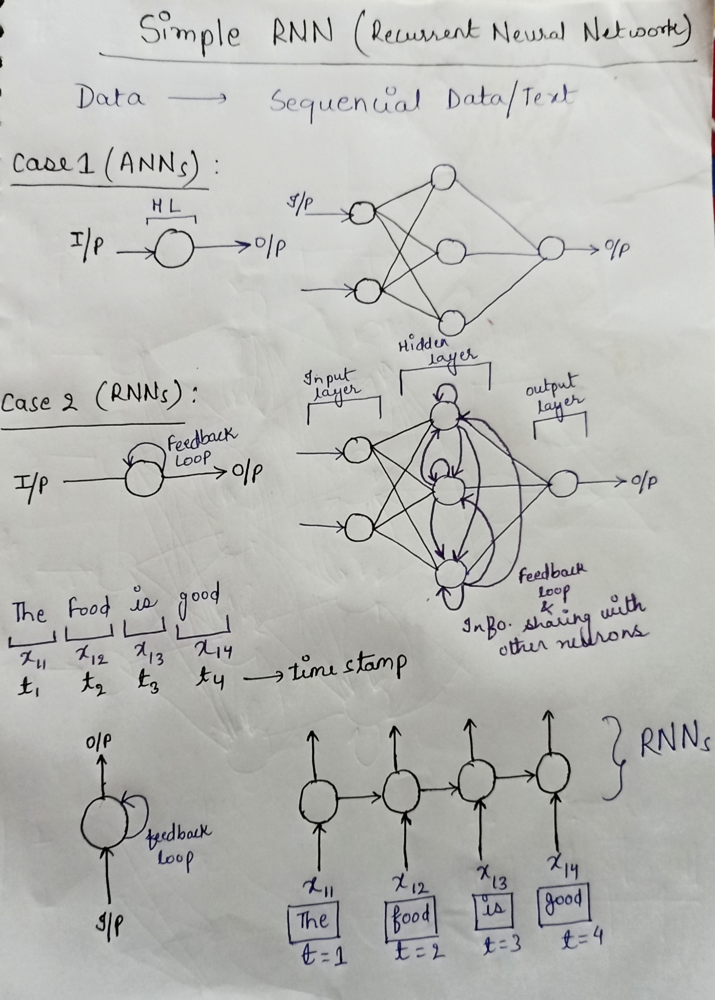

# RNNs (Recurrent Neural Networks)

- Recurrent Neural Networks (RNNs) are neural networks **designed to identify patterns in sequences of data**.
- RNNs possess a unique feature: **they have loops** (self loop & passes information to other hidden layer neurons) in them, allowing information to persist these are called **feedback loop.**
- A feedback loop in an RNN allows information to be passed from one step to the next, maintaining a‘**memory**’of previous inputs
- RNNs are designed to handle sequential data like time series, text, and speech, using this **feedback loop to process sequential data and use recurrent connections**. This allows the network to have a sense of memory and to process sequences of data.
- This means, unlike ANNs, RNNs are uniquely suited for handling sequential data—data where the order of information matters. This sequential data, like text streams, audio clips, video clips, and time-series data, can be understood by RNNs **because each input corresponds to a time stamp in a sequence**

## Vanishing Gradient

- The vanishing gradient problem, It occurs when the gradients of the loss function with respect to the model parameters become exceedingly small as they are propagated back through time during the training process.

1. **Gradients in Backpropagation Through Time (BPTT)** :

* **Unrolling the RNN** : When training an RNN, the network is "unrolled" over a number of time steps to apply the backpropagation algorithm. Essentially, the same network parameters are used across multiple time steps.
* **Gradient Calculation** : During backpropagation, the gradients of loss with respect to the weights are calculated for each time step and then summed up. These gradients are obtained by repeatedly applying the chain rule through time.

2. **Exponential Decay of Gradients** :

* **Multiplicative Effect** : In an RNN, the gradient at any given time step depends on the product of derivatives of the activation functions from all previous time steps. If these derivatives are typically less than one, the gradients can decrease exponentially as they are propagated backward in time.
* **Activation Functions** : Common activation functions (like sigmoid or tanh) have gradients that are less than one, which exacerbates the problem.

3. **Impact on Learning** :

* **Difficulty in Training Long-term Dependencies** : Since the gradients become very small, the model parameters (weights) near the beginning of the sequence (earlier time steps) learn very slowly. This makes it difficult for the RNN to capture long-term dependencies in the data.
* **Slow Convergence** : Because updates to the early layers are minimal, the convergence of the training process can become very slow.
