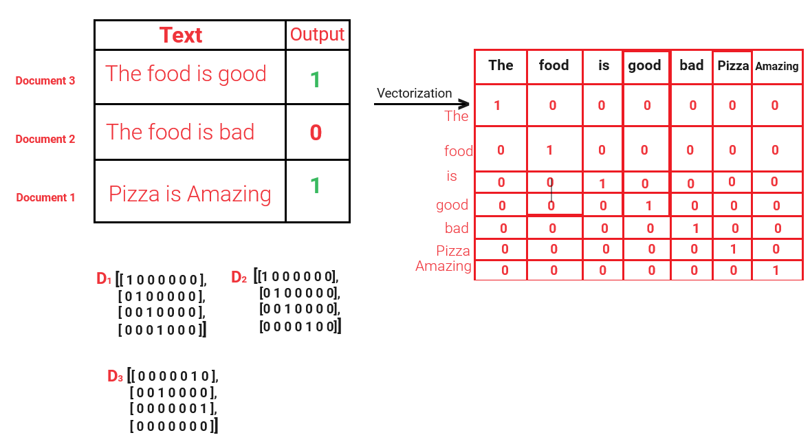
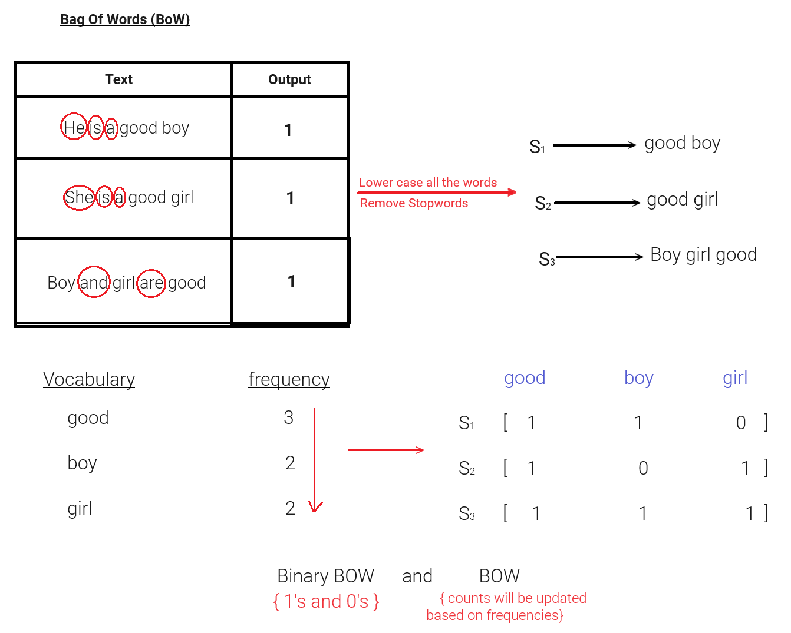

# Natural Language Processing (NLP)

Steps to Understand NLP:

There are some fundamental concepts like:

1. **Corpus** : Paragraph

* A corpus is a large and structured set of texts that are used for linguistic analysis and processing. It serves as the foundational dataset upon which NLP tasks are performed. Corpora can be general-purpose or specialized for specific domains.
* **for example** : The Brown Corpus is a well-known example of a corpus in NLP. It contains a balanced selection of texts in American English from a wide range of genres and is used for various linguistic studies.

2. **Documents** : Sentences

* In the context of a corpus, documents are individual, self-contained units of text. A document could be a sentence, a paragraph, a webpage, an article, a book, or any distinct piece of text depending on the application's requirements.
* **for example** : In a corpus of news articles, each article would be considered a document.

3. **Vocabulary** : Unique Words

* Vocabulary refers to the set of unique words and expressions found within a corpus. It is the collection of all the distinct words that appear in the corpus and typically disregards frequency.
* **for example** : If a corpus contains the text "The cat sat on the mat," the vocabulary would be {the, cat, sat, on, mat}.

4. **Words** :

* Words are the smallest independent units of language that have meaning and can be used to form sentences. In text analysis, words are usually separated by spaces or punctuation.
* **for example** : In the sentence "Hello, world!", the words are "Hello" and "world".

## Tokenization

- Tokenization is a simple process where I can convert a corpus (Paragraph) into multiple documents (sentences) as well as multiple words as tokens.

1) **Sent_tokenizer()**

Corpus = "My name is ARPIT and I have interest in building projects related to Machine Learning, Data Science, Natural Language Processing, Deep Learning, Artificial Intellegence and Generative AI. I'm also a Senior Data Scientist."

2) **word_tokenizer()**

## Stemming

- Stemming is the process of reducing a word to it;s word stem that affixes to suffixes and prefixes or to the roots of words known as a lemma.
- Stemming is important in natural language understanding (NLU) and Natural Language processing (NLP).

words= ["eating", "eats", "eaten", "writing", "writes", "programming", "programs", "history", "finally", "finalized"]

## One Hot Encoding

One hot encoding is a technique used in machine learning to convert categorical data into numerical form.

This method involves creating new binary variables for each category of the original variable. Each category is represented by a binary vector of length equal to the number of categories, where a '1' marks the presence of a specific category and '0's indicate the absence of the other categories.

**Advantages** **of one hot encoding :**

1. **Facilitation of Machine Learning Algorithms** : It allows categorical variables to be used in machine-learning algorithms that require numerical input.
2. **Avoids Ordinal Relationships** : By not assigning ordinal numbers, it helps in preventing any unintended ordinal relationship between categories. This is particularly useful when the categories don't have a natural order.
3. **Straightforward Implementation** : It is relatively straightforward to implement using libraries such as Scikit-learn or Pandas in Python.

**Disadvantages** **of one hot encoding:**

1. **Increased Dimensionality** : A significant drawback is the increase in dimensionality since it creates as many new variables as there are unique categories in the original data. This can lead to high memory usage and computational complexity, sometimes referred to as the **curse of dimensionality**.
2. **Sparse Matrices** : The resulting data usually becomes sparse, meaning most of the entries are zero, which leads to Overfitting.
3. **Not Ideal for Large Categories** : With a large number of unique categories, this approach might not be efficient.
4. No Semantic meaning is getting captured.
5. Out of vocabulary (ODV)

## Bag of Words (BoW) and Binary BoW

**The **Bag of Words (BoW)** model involves creating a vector representation where each vector dimension corresponds to a word in the vocabulary derived from the corpus. Each element of the vector is the frequency of the corresponding word in the document.**

for example:

**Sentence 1: "He is a good boy"**

**Sentence 2: "She is a good girl"**

**Sentence 3: "Boy and girl are good"**

**Vocabulary**

First, let's create a vocabulary from the sentences:

* Vocabulary: {He, is, a, good, boy, She, girl, and, are}
* Remove the stopwords: {He, is, a, She, and, are}
* Now, Vocabulary: {good, boy, girl}

| Sentences                           | good | boy | girl | output |
| ----------------------------------- | :--: | :-: | :--: | :----: |
| Sentence 1: "He is a good boy"      |  1  |  1  |  0  |   1   |
| Sentence 2: "She is a good girl"    |  1  |  0  |  1  |   1   |
| Sentence 3: "Boy and girl are good" |  1  |  1  |  1  |   1   |

If suppose we have these sentences:

**Sentence 1: "He is a good boy, a good"**

**Sentence 2: "She is a good girl"**

**Sentence 3: "Boy and girl are good"**

| Sentences                              | good | boy | girl | output |
| -------------------------------------- | ---- | --- | ---- | ------ |
| Sentence 1: "He is a good boy, a good" | 2    | 1   | 0    | 1      |
| Sentence 2: "She is a good girl"       | 1    | 0   | 1    | 1      |
| Sentence 3: "Boy and girl are good"    | 1    | 1   | 1    | 1      |

Here, frequency count of good in sentence 1 becomes 2

**Binary Bag of Words** is a variation where each vector element represents the presence (1) or absence (0) of the corresponding word, rather than its frequency.

where as, in Binary BOW the frequecy of words doesn't impact the vectors

| Sentences                              | good | boy | girl | output |
| -------------------------------------- | ---- | --- | ---- | ------ |
| Sentence 1: "He is a good boy, a good" | 1    | 1   | 0    | 1      |
| Sentence 2: "She is a good girl"       | 1    | 0   | 1    | 1      |
| Sentence 3: "Boy and girl are good"    | 1    | 1   | 1    | 1      |

| Advantages           | Disadvantages                           |
| -------------------- | --------------------------------------- |
| Simple and Intuitive | Sparse Matrix or array ---> overfitting |
| Fixed Sized          | Ordering of the words is changing       |
|                      | Out of Vocabulary (OOV)                 |
|                      | Semantic meaning is still not caputured |
