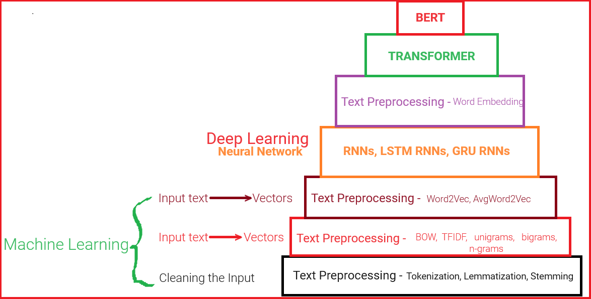
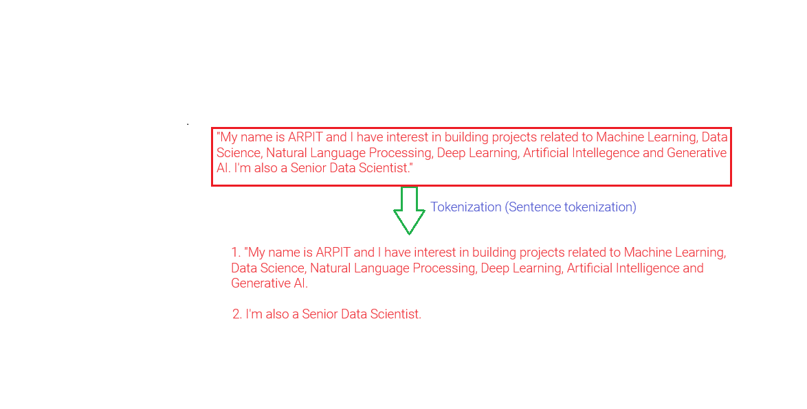
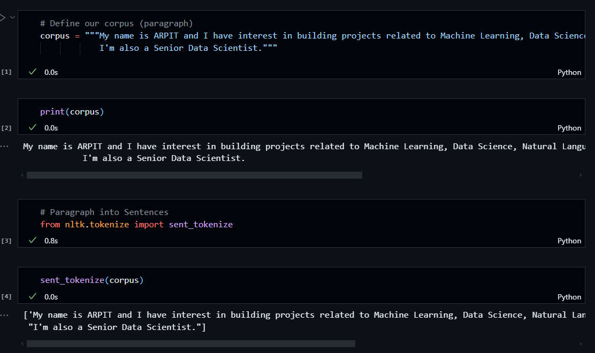
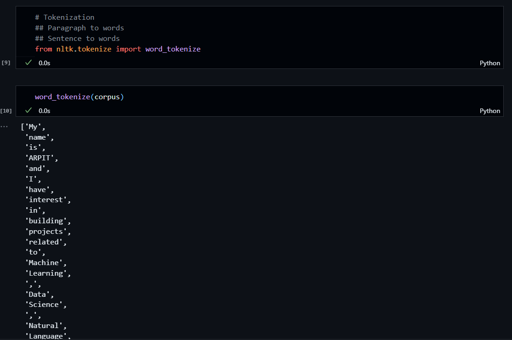

# Natural Language Processing (NLP)

Steps to Understand NLP:

There are some fundamental concepts like:

1. **Corpus** : Paragraph

* A corpus is a large and structured set of texts that are used for linguistic analysis and processing. It serves as the foundational dataset upon which NLP tasks are performed. Corpora can be general-purpose or specialized for specific domains.
* **for example** : The Brown Corpus is a well-known example of a corpus in NLP. It contains a balanced selection of texts in American English from a wide range of genres and is used for various linguistic studies.

2. **Documents** : Sentences

* In the context of a corpus, documents are individual, self-contained units of text. A document could be a sentence, a paragraph, a webpage, an article, a book, or any distinct piece of text depending on the application's requirements.
* **for example** : In a corpus of news articles, each article would be considered a document.

3. **Vocabulary** : Unique Words

* Vocabulary refers to the set of unique words and expressions found within a corpus. It is the collection of all the distinct words that appear in the corpus and typically disregards frequency.
* **for example** : If a corpus contains the text "The cat sat on the mat," the vocabulary would be {the, cat, sat, on, mat}.

4. **Words** :

* Words are the smallest independent units of language that have meaning and can be used to form sentences. In text analysis, words are usually separated by spaces or punctuation.
* **for example** : In the sentence "Hello, world!", the words are "Hello" and "world".

## Tokenization

- Tokenization is a simple process where I can convert a corpus (Paragraph) into multiple documents (sentences) as well as multiple words as tokens.

1) **Sent_tokenizer()**

Corpus = "My name is ARPIT and I have interest in building projects related to Machine Learning, Data Science, Natural Language Processing, Deep Learning, Artificial Intellegence and Generative AI. I'm also a Senior Data Scientist."

2) **word_tokenizer()**

## Stemming

- Stemming is the process of reducing a word to it;s word stem that affixes to suffixes and prefixes or to the roots of words known as a lemma.
- Stemming is important in natural language understanding (NLU) and Natural Language processing (NLP).
