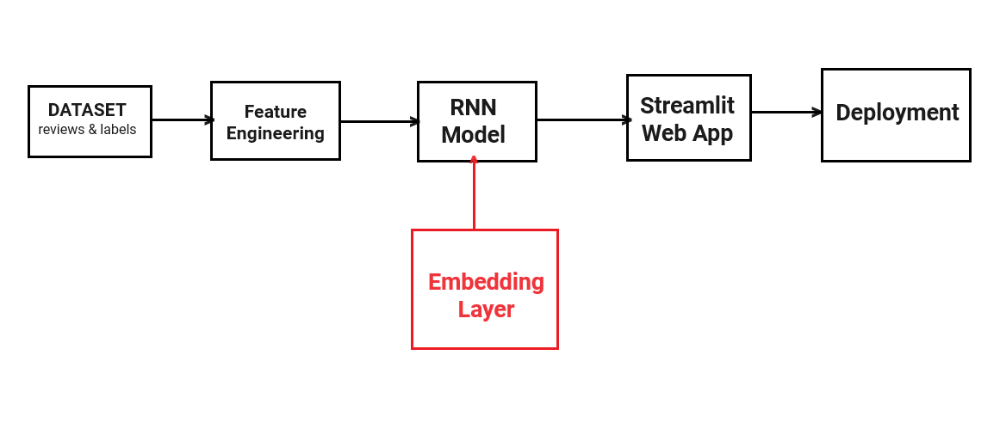
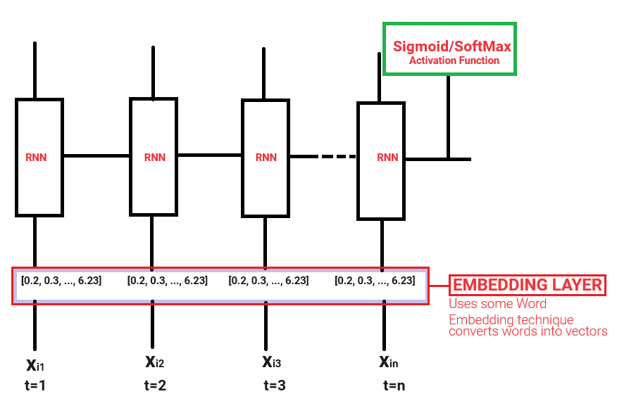

**Problem Statement:**  We have a Text Dataset of IMDB Movie Reviwes were it contains textual reviews of movies and having labels that which having positive or negative reviews. Our task is to train a model that for any new review we have to find it is a positive review or negative review.

**Embedding layers** are a fundamental component in many deep learning models, including Recurrent Neural Networks (RNNs). They play a crucial role in representing and encoding input data in a way that can be effectively processed by the neural network.

* Embedding layers are a type of neural network layer that maps discrete input features (e.g., words, tokens, or categorical variables) to a continuous, low-dimensional vector representation.
* The embedding layer learns a dense, distributed representation of the input features, where semantically similar features are mapped to nearby points in the vector space.
* The learned embeddings capture the underlying relationships and patterns in the input data, which can be leveraged by the subsequent layers of the neural network.

